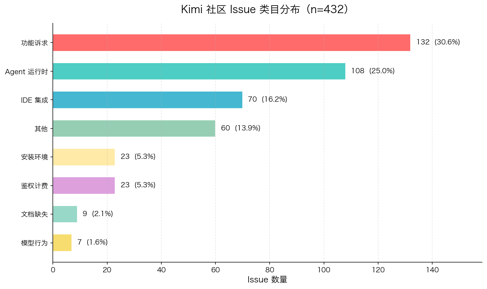

# Kimi 社区 Issue 洞察雷达

> 自动抓取 MoonshotAI 开源仓库 GitHub Issues，用 Kimi API 做聚类与归因，输出一份可行动的 DevRel 洞察报告。

[](https://www.python.org/)
[](./LICENSE)

这个项目是为 **Developer Relations (Content) Intern** 岗位准备的作品：它从开发者社区的一线反馈出发，用自动化工具把散落的 issue 收敛成产品、文档、运营都能看懂的可行动结论。

---

## 你想做什么？

选择你的起点：

| 🚀 [快速跑通](#快速开始) | 📊 [看分析结果](#核心结果) | 🛠️ [排查问题](./docs/troubleshooting.md) | 🧩 [了解设计思路](#设计亮点) |
|---|---|---|---|
| 5 分钟让 demo 跑起来 | 432 条 issue 的类目分布与洞察 | 常见报错和解决方式 | 类目体系、Prompt 约束、工程兜底 |

---

## 核心结果

对 2026-01-27 至 2026-07-30 期间的 **432 条有效 issue** 分析后，得到以下关键发现：

| 维度 | 结果 |
|---|---|
| Open / Closed | 384 / 48 |
| 最集中类目 | `feature_request`（132 条，30.6%） |
| 最致命类目 | `agent_runtime`（108 条，blocker 占比最高） |
| 静默挂起类 blocker | 约 20+ 条指向同一失败模式 |
| 付费用户额度投诉 | 多条年订阅 / 月订阅用户反馈 |
| 模型质量反馈 | `model_behavior` 仅 7 条（1.6%） |



> **关于样本量**：432 条是近期活跃 issue 的采样结果。`kimi-code` 实际约有 764 条 issue，抓取层默认 `max_pages=10`，因此只取到最近的 334 条有效 issue；`kimi-agent-sdk` 共 98 条，已全量抓取。该样本足以支撑趋势和 blocker 模式洞察，全量分析可调整分页参数。

完整洞察见 [`report.md`](./report.md)。

---

## 快速开始

### 步骤 1：安装依赖

```bash
pip install -r requirements.txt
```

### 步骤 2：运行 mock 模式验证

没有 API key 也能跑通全流程：

```bash
python3 radar.py --mock
```

运行后会生成：
- `issues_raw.json`
- `issues_analyzed.json`
- `report.md`

### 步骤 3：接入真实数据（可选）

```bash
export GITHUB_TOKEN=ghp_xxx          # 可选，避免 60 次/小时限流
export KIMI_API_KEY=sk-xxx           # 必须，否则自动降级为 mock 分析
python3 radar.py
```

> 💡 **Tip**：`GITHUB_TOKEN` 不是强制的，但没有它时抓取大仓库容易触发限流。建议在 `.env` 文件里配置，项目已提供 `.env.example`。

### 步骤 4：生成可视化图表

```bash
python3 generate_chart.py
```

---

## 常用场景

### 场景 A：只想分析报告，不想重新抓数据

```bash
python3 radar.py --skip-fetch
```

### 场景 B：想换模型或调 batch size

```bash
python3 radar.py \
  --model kimi-k3 \
  --batch-size 14 \
  --body-limit 800 \
  --timeout 180
```

### 场景 C：只分析指定仓库

```bash
python3 radar.py --repos MoonshotAI/kimi-code
```

> ⚠️ **Note**：`kimi-k3` 对大批量长文本推理较慢，当前默认模型为 `kimi-k2.7-code-highspeed`，在速度和稳定性之间更平衡。

---

## 这个项目本质上是什么？

严格来说，它是一个 **LLM-powered workflow（自动化工作流）**，而不是 Agent。

| | 本项目 | 典型 Agent |
|---|---|---|
| 决策方式 | 流程固定：抓取 → 分批 → 分析 → 报告 | 自主决策下一步动作 |
| 工具调用 | 无循环，只调一次 Kimi API | 观察结果 → 调工具 → 再观察 |
| 目标 | 完成一次性的分类和报告 | 为开放目标持续执行直到完成 |
| 人机交互 | 运行一次，结束 | 可接收反馈，动态调整 |

所以更准确的定位是：

> **一个把开发者社区反馈自动转换成结构化洞察的数据管道。**
>
> LLM 在这里扮演的角色是「分类器」和「摘要器」，而不是「自主决策者」。

---

## 如何向 Agent 演进？

如果想让这个项目从 workflow 升级成轻量 Agent，可以增加**基于分析结果的自主行动**：

### 阶段 1：决策分支（现在可快速实现）

根据洞察结果自动触发不同动作：

```python
if agent_runtime_blocker_count > 5:
    create_github_issue("本周 agent_runtime blocker 超标，需专项跟进")
    notify_slack("#devrel", "agent_runtime blocker 警报")

if docs_gap_count > 0:
    generate_doc_entry("建议补充的文档条目.md")
```

### 阶段 2：工具调用循环

让 Agent 自己决定需要调用哪些工具来完成目标：

- 发现 blocker 过多 → 调用 `create_github_issue`
- 发现文档缺口 → 调用 `generate_doc_entry`
- 发现趋势变化 → 调用 `send_weekly_report_email`

### 阶段 3：目标驱动的自动化闭环

给定目标「持续提升开发者文档质量」，Agent 可以：

1. 每周自动抓取新增 issue
2. 聚类出高频问题
3. 判断哪些问题可以用文档解决
4. 自动生成文档草稿或更新建议
5. 文档上线后继续监控同类 issue 是否减少

```
社区反馈 ──▶ 分析洞察 ──▶ 生成文档/动作 ──▶ 观察反馈变化
   ▲                                          │
   └──────────────── 循环优化 ────────────────┘
```

当前版本是阶段 0 的完整实现：自动化收集和结构化。向 Agent 演进的关键是**让系统根据中间结果自主决定下一步做什么**，而不是只按固定脚本执行。

---

## 项目架构

```
┌─────────────┐     ┌─────────────┐     ┌─────────────┐
│  GitHub API │────▶│  数据清洗   │────▶│ issues_raw  │
└─────────────┘     └─────────────┘     └──────┬──────┘
                                                │
                                                ▼
┌─────────────┐     ┌─────────────┐     ┌─────────────┐
│  Kimi API   │◀────│  分批分析   │◀────│  issue batch│
└──────┬──────┘     └─────────────┘     └─────────────┘
       │
       ▼
┌─────────────┐     ┌─────────────┐
│ 分类/severity│────▶│ issues_analyzed│
│  evidence   │     └──────┬──────┘
└─────────────┘            │
                           ▼
                    ┌─────────────┐
                    │  report.md  │
                    └─────────────┘
```

### 三层职责

1. **抓取层**：分页拉取 GitHub Issues，用 `pull_request` 字段过滤 PR，只保留分析必需字段，body 截断避免日志噪音。
2. **分析层**：每批 14 条送入 Kimi API，做**受限分类**（8 个类目），输出 category / severity / one_line / evidence。
3. **报告层**：生成总量、分布、blocker 清单与核心洞察。

---

## 文件说明

| 文件 | 说明 |
|---|---|
| `radar.py` | 主脚本：抓取 + 分析 + 报告 |
| `generate_chart.py` | 从 `issues_analyzed.json` 生成类目分布图 |
| `requirements.txt` | Python 依赖 |
| `report.md` | 最终洞察报告 |
| `EVOLUTION.md` | 技术迭代链路：从 mock 到真实 API 的踩坑记录 |
| `INTERVIEW_SCRIPT.md` | 基于本项目整理的 DevRel 面试演讲稿 |
| `issues_raw.json` | 432 条原始 issue（body 截断 1500） |
| `issues_raw_800.json` | 432 条原始 issue（body 截断 800，用于快速分析） |
| `issues_analyzed.json` | 带 category / severity / evidence 的分析结果 |
| `docs/troubleshooting.md` | 常见问题和排查指南 |

---

## 设计亮点

### 受限分类体系

不让模型自由发挥，而是固定 8 个类目，每个对应归属方：

| 类目 | 中文名称 | 归属方 | 含义 |
|---|---|---|---|
| `install_env` | 安装环境 | 文档 | 安装、依赖、Node 版本、系统环境 |
| `ide_integration` | IDE 集成 | 产品 | VSCode / JetBrains / Zed 插件、ACP 协议接入 |
| `auth_billing` | 鉴权计费 | 文档 | API key、鉴权、额度、计费 |
| `model_behavior` | 模型行为 | 模型 | 模型输出质量、幻觉、不 follow 指令 |
| `agent_runtime` | Agent 运行时 | 产品 | Agent 执行、工具调用、任务中断 |
| `docs_gap` | 文档缺失 | 文档 | 文档缺失、示例不可用、说明不清 |
| `feature_request` | 功能诉求 | 产品 | 功能诉求 |
| `other` | 其他 | 兜底 | 其他 |

#### 为什么设计这 8 个类目？

类目按两个维度设计：**开发者使用旅程** + **内部归属方**。

**使用旅程维度**：安装 → 登录/配置 → IDE 接入 → Agent 运行 → 模型调优 → 提新需求。每个类目对应其中一个卡点。

**归属方维度**：每个类目直接对应一个内部团队，让 DevRel 报告能直接生成 action items：

- 文档侧：`install_env`、`auth_billing`、`docs_gap`
- 产品侧：`ide_integration`、`agent_runtime`、`feature_request`
- 模型侧：`model_behavior`
- 兜底：`other`

**粒度取舍**：没有再细分（如把 `agent_runtime` 拆成 MCP/子 agent/工具调用），因为 MVP 阶段它们都归产品团队，拆太细不会增加行动价值，反而让模型更容易分错。`other` 不是设计缺陷，而是拒绝猜测的安全阀。

### 强制 evidence

每条分类必须附带 issue 原文片段，保证结论可追溯、可验证，而不是模型拍脑袋。

### PR 过滤实测

GitHub 的 `/issues` 接口会把 Pull Request 也混在 issues 里返回。实测调用 `GET /repos/MoonshotAI/kimi-code/issues?state=all&per_page=10&page=1` 时，返回的 10 条记录中有 **4 条是 PR**，真实 issue 仅占 60%。

代码里通过判断 `pull_request` 字段是否存在来过滤：

```python
if item.get("pull_request") is not None:
    continue
```

不过滤会导致分析结论被代码提交严重污染。

### 工程兜底

真实跑 LLM 批量任务时，网络抖动、模型超时、返回格式异常是常态。代码里做了四层兜底，保证流程不中断、坏结果不混入。

#### 1. 指数退避重试

网络瞬时失败时自动重试 3 次，间隔指数增长：2s → 4s → 8s。

```python
def retry_request(func, max_retries=3, backoff_base=2):
    for attempt in range(max_retries):
        try:
            return func()
        except requests.RequestException as e:
            wait = backoff_base * (2 ** attempt)
            log(f"请求失败（{attempt+1}/{max_retries}）：{e}，{wait}s 后重试…")
            time.sleep(wait)
```

**实际效果**：本次全量 31 个 batch 中，有几次请求第一次失败，重试后成功，没有因网络问题中断。

#### 2. 服务端错误详情透传

Kimi API 返回 400 时，把错误体打印出来，而不是只报 "HTTP 400"。

**例子**：调试初期遇到：

```json
{"error": {"message": "invalid temperature: only 1 is allowed for this model"}}
```

代码捕获后直接显示这个信息，帮我 10 秒内定位是 temperature 参数问题，而不是猜半天。

```python
if resp.status_code >= 400:
    body = resp.text[:500]
    raise requests.HTTPError(f"{resp.status_code} {resp.reason}: {body}", response=resp)
```

#### 3. JSON 围栏自动剥离

模型偶尔会输出：

````markdown
```json
[{"number": 1, "category": "agent_runtime"}]
```
````

直接 `json.loads` 会失败。代码先做 strip：

```python
text = re.sub(r"^```json\s*", "", text, flags=re.IGNORECASE)
text = re.sub(r"^```\s*", "", text)
text = re.sub(r"\s*```$", "", text)
```

#### 4. 解析失败整批标记 `other`

如果某个 batch 实在解析不了（比如模型返回空 content、JSON 被截断），不会让整个程序崩溃，而是把这批全部标为 `other`：

```python
results = [
    {
        "number": issue["number"],
        "category": "other",
        "severity": "friction",
        "one_line": "分析失败，待人工复核",
        "evidence": "",
    }
    for issue in batch
]
```

**实际效果**：本次 432 条 issue 全部分析成功，0 个 batch 因异常进入兜底。但这层保护确保了即使遇到模型不稳定，也不会污染其他 batch 的结论。

---

## 踩坑记录

真实 API 调用中遇到的典型问题都记录在 [`EVOLUTION.md`](./EVOLUTION.md)，主要包括：

- Kimi API 当前所有模型只支持 `temperature=1`
- `kimi-k3` 对大批量长文本推理易超时，最终降级到 `kimi-k2.7-code-highspeed`
- `max_tokens` 不足会导致空返回或 JSON 截断，最终稳定在 12000
- batch size 从 18 降到 14 后，432 条 issue 全部分析成功

---

## 与 DevRel 岗位的关联

这个作品直接对应 Developer Relations (Content) Intern 的核心职责：

- **深入开发者社区**：抓取并分析 432 条真实 GitHub issue
- **从开发者视角体验产品**：自己调 Kimi API，踩过 temperature、max_tokens、超时等真实开发者会踩的坑
- **自动化反馈整理**：用 Python + Kimi API 把手动读帖变成结构化洞察
- **开发者文档优化**：报告中的洞察直接指向“文档该写什么”，如 K3 思考机制、静默挂起排查、额度预警
- **AI Coding 生态关注**：issue 覆盖 VSCode 插件、MCP、Agent 运行时等前沿开发者工具链

---

## 下一步可以做什么？

- 📈 给 radar 加**时间趋势分析**：看哪些类目在上升 / 下降
- 📝 自动生成「建议补充的文档条目」清单
- 🔌 接入 Discord / Reddit 等更多开发者社区数据源
- ⏰ cron 化：每日/每周自动生成增量报告
- 🤖 把 radar 升级为「社区反馈 → 文档缺口」的 AI 自动化闭环

详细扩展思路见 [`EVOLUTION.md`](./EVOLUTION.md)。

---

## 作者

- GitHub: [@zhiman01](https://github.com/zhiman01)
- 本项目为 DevRel Content Intern 面试准备的作品
