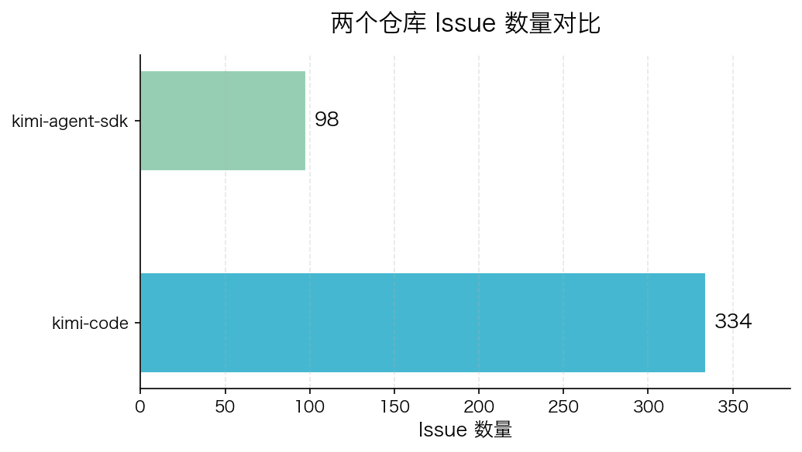
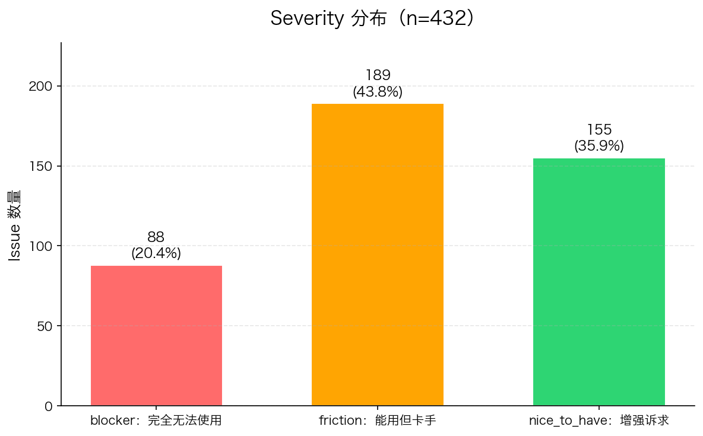

# Kimi 社区 Issue 洞察报告

> **分析对象**：MoonshotAI/kimi-code + MoonshotAI/kimi-agent-sdk  
> **时间范围**：2026-01-27 ~ 2026-07-30  
> **生成时间**：2026-07-31T08:32:34.264050  
> **分析模型**：kimi-k2.7-code-highspeed

---

## 目录

- [执行摘要](#执行摘要)
- [1. 总体概况](#1-总体概况)
- [2. 类目分布](#2-类目分布)
- [3. Severity 分布](#3-severity-分布)
- [4. Blocker 级问题清单](#4-blocker-级问题清单)
- [5. 核心洞察](#5-核心洞察)
- [附录：分析方法](#附录分析方法)

---

## 执行摘要

| 指标 | 数值 | 说明 |
|---|---|---|
| **Issue 总量** | **432** | **近期活跃采样，非全量** |
| **Open / Closed** | **384 / 48** | 开放 issue 占 88.9% |
| **Blocker** | **88** | 完全无法使用的问题 |
| **最集中类目** | **feature_request** | 132 条，占 30.6% |
| **最致命类目** | **agent_runtime** | 108 条，blocker 占比最高 |
| **采样偏差** | — | `kimi-code` 实际约 764 条，仅取近期 334 条 |

**三个最值得关注的问题模式**：

1. 🚨 **接入与运行时是主战场** —— `agent_runtime` + `ide_integration` 合计 178 条，占 41%
2. 🔇 **"静默挂起"正在流失新用户** —— 20+ 条 blocker 指向同一失败模式：不报错、直接卡死
3. 💸 **付费用户额度体验差** —— 年订阅 / 月订阅用户均出现任务中断、token 作废、无预警限流

---

## 1. 总体概况

| 指标 | 数值 |
|---|---|
| 仓库数 | 2 |
| Issue 总量 | 432 |
| Open 数 | 384 |
| Closed 数 | 48 |
| Open/Closed 比例 | 384:48 |
| 时间跨度 | 2026-01-27 ~ 2026-07-30 |
| 分析模型 | kimi-k2.7-code-highspeed |

> **样本说明**：432 条是近期活跃 issue 的采样结果。`kimi-code` 实际约有 764 条 issue，因抓取层默认 `max_pages=10`，只取到最近的 334 条有效 issue；`kimi-agent-sdk` 共 98 条，已全量抓取。

### 仓库对比

---

## 2. 类目分布

| 排名 | 类目 | 中文名称 | 数量 | 占比 | 归属方 |
|---|---:|---|---|---:|---:|
| 1 | `feature_request` | 功能诉求 | 132 | 30.6% | 产品 |
| 2 | `agent_runtime` | Agent 运行时 | 108 | 25.0% | 产品 |
| 3 | `ide_integration` | IDE 集成 | 70 | 16.2% | 产品 |
| 4 | `other` | 其他 | 60 | 13.9% | 兜底 |
| 5 | `install_env` | 安装环境 | 23 | 5.3% | 文档 |
| 6 | `auth_billing` | 鉴权计费 | 23 | 5.3% | 文档 |
| 7 | `docs_gap` | 文档缺失 | 9 | 2.1% | 文档 |
| 8 | `model_behavior` | 模型行为 | 7 | 1.6% | 模型 |

---

## 3. Severity 分布

| 等级 | 数量 | 占比 | 含义 |
|---|---:|---:|---|
| **blocker** | 88 | 20.4% | 完全无法使用 |
| **friction** | 189 | 43.7% | 能用但卡手 |
| **nice_to_have** | 155 | 35.9% | 增强诉求 |

**关键信号**：每 5 条反馈中就有 1 条是 blocker，且 34 个集中在 `agent_runtime`。

---

## 4. Blocker 级问题清单

> 以下按类目分组，每组展示最具代表性的 2-3 条。完整 88 条 blocker 见 [`issues_analyzed.json`](./issues_analyzed.json)。

### 4.1 Agent 运行时（34 条 blocker）

- **#2427** [Edit 失败后陷入死循环：反复"Edit 失败 → 重读 → 再失败"](https://github.com/MoonshotAI/kimi-code/issues/2427)
  - agent 没有诊断失败原因，连续十余次重复 Edit，最终删空多个章节。
- **#2388** [browser-use agent 的 Playwright 在 Windows 上泄漏句柄，冻结桌面](https://github.com/MoonshotAI/kimi-code/issues/2388)
  - `explorer.exe` 和 `dwm.exe` 累积句柄/线程，导致桌面 shell 卡死。
- **#2327** [AI agent 未经授权删除 template 文件](https://github.com/MoonshotAI/kimi-code/issues/2327)
  - Kimi Code 自主执行了破坏性的 `rm -rf` 命令。

### 4.2 IDE 集成（12 条 blocker）

- **#2265** [Can't Stop in VS Code](https://github.com/MoonshotAI/kimi-code/issues/2265)
  - VS Code 里无法停止或中断 Kimi。
- **#2152** [VSCode 调用 API 频繁 engine_overloaded](https://github.com/MoonshotAI/kimi-code/issues/2152)
  - 未超限额但基本不可用。

### 4.3 安装环境（8 条 blocker）

- **#2225** [Windows 下 kimi.exe 被 Smart App Control 拦截](https://github.com/MoonshotAI/kimi-code/issues/2225)
  - CLI 二进制未 Authenticode 签名，被系统拦截。
- **#2330** [Can't install from IRAN](https://github.com/MoonshotAI/kimi-code/issues/2330)
  - 地区限制导致无法安装。

### 4.4 鉴权计费（8 条 blocker）

- **#2389** [额度 403 静默杀掉所有 subagent，会话空转数小时](https://github.com/MoonshotAI/kimi-code/issues/2389)
  - 订阅额度耗尽时无 surfaced error。
- **#1796** [HTTP 429 被丢弃，永久挂起](https://github.com/MoonshotAI/kimi-code/issues/1796)
  - rate-limit 错误和 Retry-After 都被吞掉。

### 4.5 其他（21 条 blocker）

- **#2378** [API 网关对 PDF document 块返回无原因 400，污染后续会话](https://github.com/MoonshotAI/kimi-code/issues/2378)
- **#2364** [每次查询思考 30 分钟后停止，token 被消耗任务未完成](https://github.com/MoonshotAI/kimi-code/issues/2364)

---

## 5. 核心洞察

> ⚠️ **说明**：本节结论由人工判断得出，而非按类目数量自动排序。"数量最多"不等于"最重要"，以下三条基于问题的性质与业务影响，而非计数。

---

### 🎯 洞察 1：模型能力不是瓶颈，接入与运行时才是

| 关键数据 | 含义 |
|---|---|
| `model_behavior` 仅 **7 条（1.6%）** | 开发者几乎不抱怨模型智能水平 |
| `agent_runtime` + `ide_integration` = **178 条（41%）** | 问题集中在最后一公里工程体验 |

> **结论**：对一家以模型能力著称的公司，这是积极信号——**模型能力已不是短板，真正的护城河在接入体验与运行时稳定性**。文档、教程与 onboarding 内容应把重心从"展示能力"转向"解决装不上、连不上、跑到一半挂了"。

---

### 🚨 洞察 2：一整类"静默挂起"问题正在侵蚀新用户信任

多条 blocker 指向同一根因：**出错时不报错，直接静默卡死**。

| 现象 | issue |
|---|---|
| `kimi -p` 非交互模式挂起，零输出 | #2358 |
| Windows 每次 prompt 永久卡死 | #2219 |
| 流式响应中途静默，整轮阻塞 | #1798 |
| 遇到 HTTP 429 直接吞掉错误与 Retry-After | #1796 |
| K3 max effort 下挂起 10 分钟以上，Ctrl+C 无响应 | #1911 |

> **结论**：这不是零散 bug，而是**同一种失败模式**。报错尚可排查，静默卡死只会导致卸载。建议优先建立"任何失败都必须向用户显性反馈"的兜底机制，这是留存新用户的关键一环。

---

### 💸 洞察 3：付费用户的额度体验正在制造流失

以下反馈来自已付费用户，愤怒点高度一致：**付了钱、任务跑到一半、额度耗尽、成果全丢、且无明确提示**。

| 场景 | issue |
|---|---|
| 额度耗尽时静默杀掉所有 subagent，会话空转数小时 | #2389 |
| 触发限额，5 小时 deep research 的 token 全部作废 | #1482 |
| 刚充月订阅，用 4 次即被限流 | #158 |
| 年订阅遭遇持续 401，服务完全不可用 | #133 |

> **结论**：对一家 API First、依赖付费转化的公司，这类问题直接影响营收留存。核心不在额度本身，而在**"耗尽时的处理方式"**——无预警、无优雅降级、无成果保全。

---

### 🔍 附：一个被高频踩中的坑（亲测复现）

**#1955**（"20k tokens to say hi"）与 **#2364**（思考 30 分钟耗尽 token、任务未完成）指向同一问题：

> **K3 强制思考，且思考 token 计入输出配额，在简单任务上造成显著浪费。**

这与我首次调用 K3 API 时的实测一致——请求仅想回复两字，却因思考未结束撞上 token 上限而返回空结果。

**建议**：在「快速开始」文档中明确提示 K3 的思考特性与 token 预算，可为新用户规避大量困惑。

---

## 附录：分析方法

1. **数据源**：GitHub REST API `/repos/{owner}/{repo}/issues?state=all`
2. **PR 过滤**：通过 `pull_request` 字段是否存在剔除 Pull Request
3. **分析模型**：kimi-k2.7-code-highspeed，temperature=1.0，max_tokens=12000
4. **分批策略**：每批 14 条 issue，共 31 个 batch
5. **分类约束**：8 个受限类目，强制输出原文 evidence
6. **样本说明**：432 条为近期活跃 issue 采样，非全量

---

*本报告由 Kimi 社区 Issue 洞察雷达自动生成，核心洞察经人工判断。*
